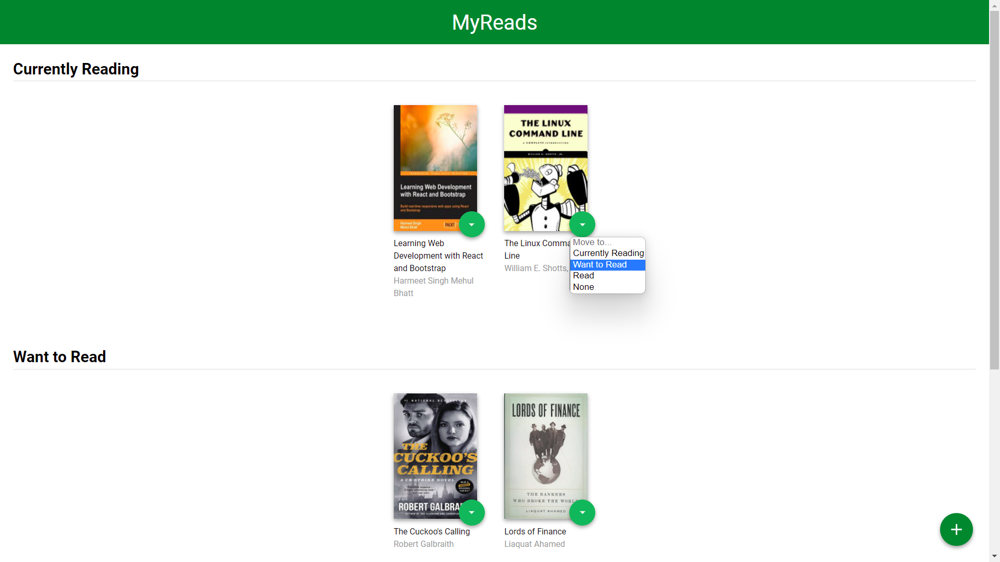
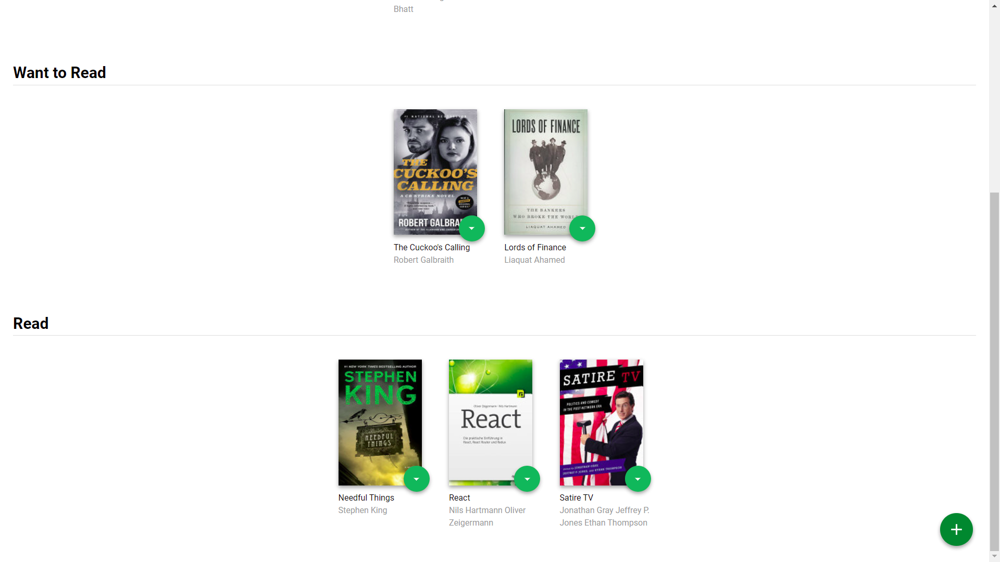
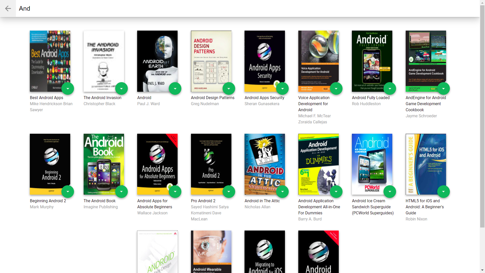
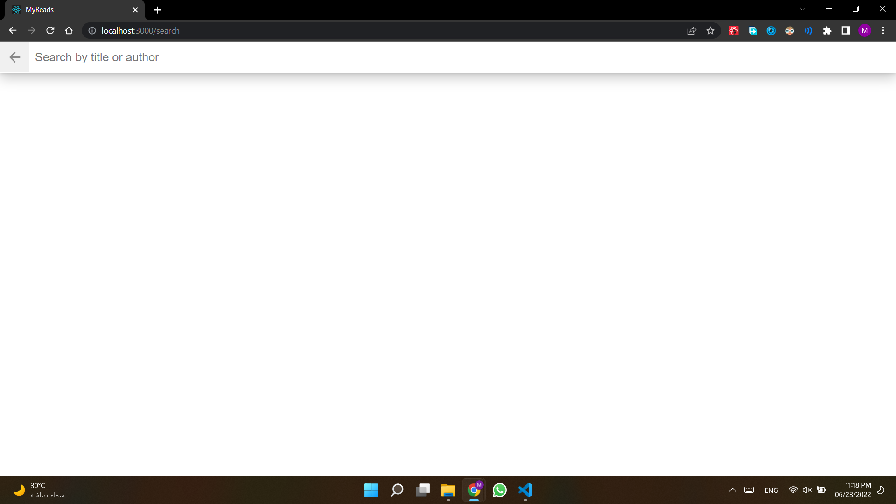

# MyReads Project

## Introduction 

A front-end web application tht regulates your books into 3 separate categories with ability to add new books and remove them

## Details

This project uses  [Create React App](https://github.com/facebookincubator/create-react-app)
 and a backend api provieded by Udacity .
* The main page shows a control that allows users to move books between shelves. The control should be tied to each book instance. The functionality of moving a book to a different shelf works correctly.
* When the browser is refreshed, the same information is displayed on the page.
* the search page have a search input that lets users search for books , it can be accessed using the (+) sign in the bottom right corner
*  Search results on the search page allow the user to select “currently reading”, “want to read”, or “read” to place the book in a certain shelf.
*  Each book is assigned a shelf according to its current state [ Currently Reading ,Want to Read , Read  ]  
*  the book's state can be changed by selecting a new option from the green botton in front of it

## Home page

#### The main landing page with the current state of books and ability to change its shelf or remove completely it from the dropdown menu

 
 
 

#### The user can add new books using the `+` button

 
 
 

 
## Search page and routing

* The app provides search functionality by utilizing its API 
* Each user can search for any book and add it to any of his shelves.
* The state of the books is consistent and won't be affected by restarts or closing the browser
 
  
 
 

* The app also have a proper routing in the displayed URL

  
 
 

 
## Installation 
 The application was created with `create-react-app` and requires only `npm install` and `npm start` or `yarn start` to get it installed and launched an localhost.

#### Note: This project was made as a requirement to graduate from Udacity's React Development Cross-Skilling Nanodegree Program.
